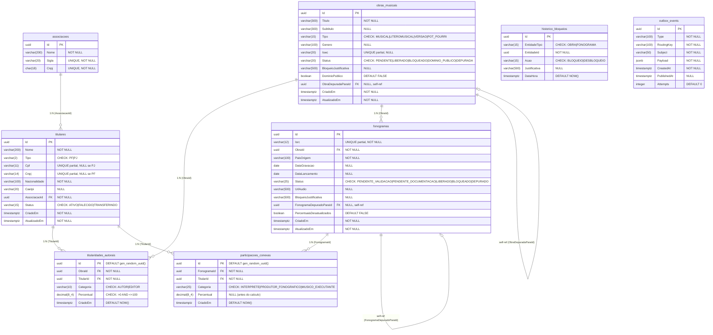

# Modelagem de Banco de Dados — Schema `cadastro`

> **Database:** mcad | **Schema:** cadastro | **Host:** db.tasso.dev.br:5432
> **Extensão:** pg_trgm (trigram indexes para ILIKE)
> **Gerado em:** 2026-04-01

---

## Diagrama ER (Mermaid)

---

## Resumo das Tabelas

| # | Tabela | Registros | Propósito |
|---|--------|-----------|-----------|
| 1 | `associacoes` | 7 (seed fixo) | Associações de gestão coletiva do ECAD |
| 2 | `titulares` | N | Titulares de direitos (PF/PJ) com CPF/CNPJ como Value Objects |
| 3 | `obras_musicais` | N | Obras musicais com ISWC, depuração e domínio público |
| 4 | `titularidades_autorais` | N | Vínculo titular↔obra com categoria (Autor/Editor) e percentual (soma=100%) |
| 5 | `fonogramas` | N | Gravações com ISRC, depuração e participações conexas |
| 6 | `participacoes_conexas` | N | Vínculo titular↔fonograma com cálculo automático (43,7/41,7/14,6) |
| 7 | `historico_bloqueios` | N | Auditoria de bloqueios/desbloqueios (polimórfica) |
| 8 | `outbox_events` | N | Outbox Pattern para publicação de eventos no RabbitMQ |

## Relacionamentos

| Origem | → | Destino | Tipo | FK |
|--------|---|---------|------|-----|
| titulares | → | associacoes | N:1 | AssociacaoId |
| titularidades_autorais | → | obras_musicais | N:1 | ObraId |
| titularidades_autorais | → | titulares | N:1 | TitularId |
| fonogramas | → | obras_musicais | N:1 | ObraId |
| participacoes_conexas | → | fonogramas | N:1 | FonogramaId |
| participacoes_conexas | → | titulares | N:1 | TitularId |
| obras_musicais | → | obras_musicais | self-ref | ObraDepuradaParaId |
| fonogramas | → | fonogramas | self-ref | FonogramaDepuradoParaId |

## Índices

| Tabela | Índice | Tipo | Colunas |
|--------|--------|------|---------|
| titulares | ix_titulares_nome | GIN (trigram) | Nome |
| titulares | ix_titulares_associacao | B-tree | AssociacaoId |
| titulares | ix_titulares_status | B-tree | Status |
| titulares | uq_titulares_cpf | Unique partial | Cpf WHERE IS NOT NULL |
| titulares | uq_titulares_cnpj | Unique partial | Cnpj WHERE IS NOT NULL |
| obras_musicais | ix_obras_titulo | GIN (trigram) | Titulo |
| obras_musicais | ix_obras_tipo | B-tree | Tipo |
| obras_musicais | ix_obras_status | B-tree | Status |
| obras_musicais | uq_obras_iswc | Unique partial | Iswc WHERE IS NOT NULL |
| obras_musicais | ix_obras_depurada_para | B-tree partial | ObraDepuradaParaId WHERE IS NOT NULL |
| titularidades_autorais | ix_titularidades_obra | B-tree | ObraId |
| titularidades_autorais | ix_titularidades_titular | B-tree | TitularId |
| titularidades_autorais | uq_titularidades_obra_titular_categoria | Unique | (ObraId, TitularId, Categoria) |
| fonogramas | ix_fonogramas_obra | B-tree | ObraId |
| fonogramas | ix_fonogramas_status | B-tree | Status |
| fonogramas | uq_fonogramas_isrc | Unique partial | Isrc WHERE IS NOT NULL |
| fonogramas | ix_fonogramas_depurado_para | B-tree partial | FonogramaDepuradoParaId WHERE IS NOT NULL |
| participacoes_conexas | ix_participacoes_fonograma | B-tree | FonogramaId |
| participacoes_conexas | ix_participacoes_titular | B-tree | TitularId |
| participacoes_conexas | uq_participacoes_fono_titular_cat | Unique | (FonogramaId, TitularId, Categoria) |
| historico_bloqueios | ix_historico_entidade | B-tree | (EntidadeTipo, EntidadeId) |
| outbox_events | ix_outbox_pendentes | B-tree partial | (PublishedAt, Attempts) WHERE PublishedAt IS NULL AND Attempts < 10 |

## Padrões de Design

1. **Schema-per-Service** — tudo isolado no schema `cadastro`
2. **Value Objects** — Cpf, Cnpj, Isrc, CaeIpi persistidos via HasConversion (record → string)
3. **Enums como VARCHAR** — Status, Tipo, Categoria com CHECK constraints
4. **Unique parcial** — permite múltiplos NULL (Cpf, Cnpj, Iswc)
5. **Self-referencing FK** — depuração de obras e fonogramas
6. **Percentual nullable** — participações conexas: null = não calculado
7. **GIN trigram** — busca ILIKE performática em Nome e Titulo
8. **Outbox Pattern** — eventos com PublishedAt + Attempts + índice parcial
9. **Polimorfismo** — historico_bloqueios com EntidadeTipo (OBRA/FONOGRAMA)
10. **DELETE RESTRICT** — todas as FKs impedem exclusão em cascata
