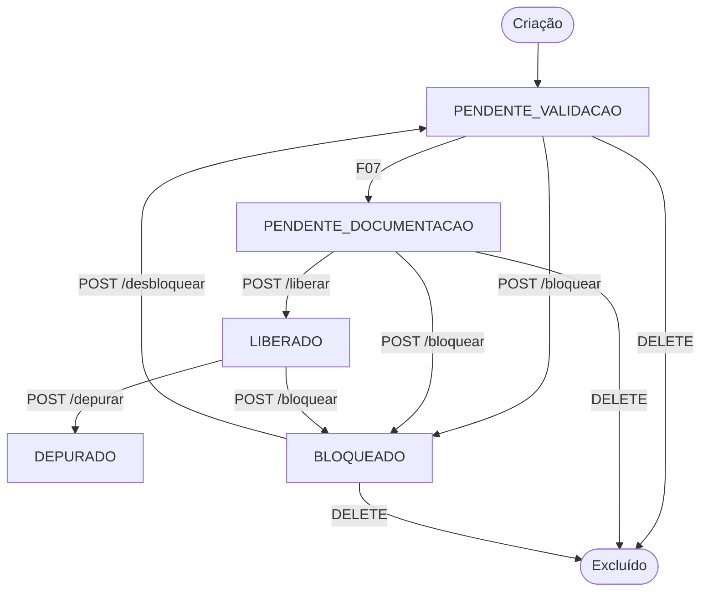
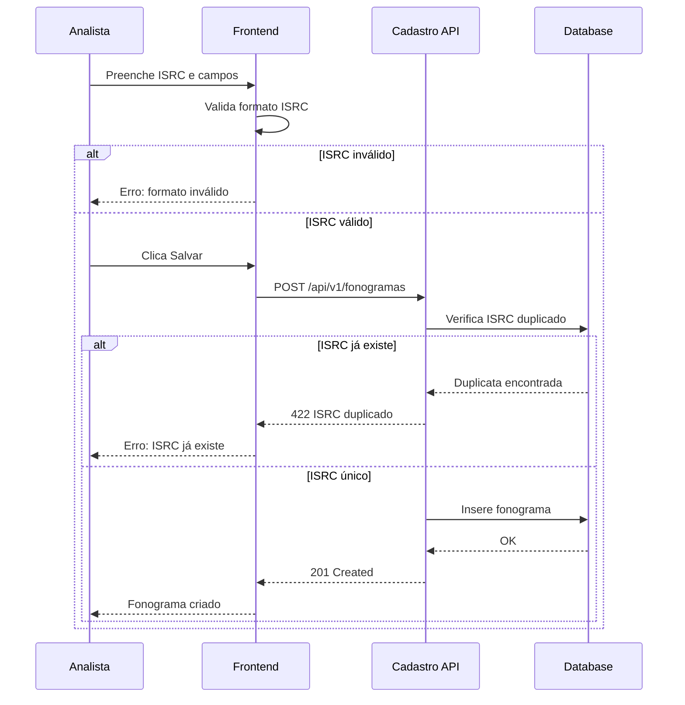
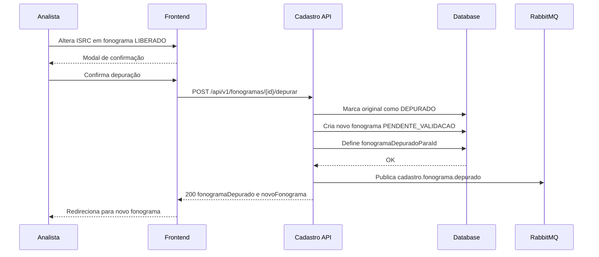
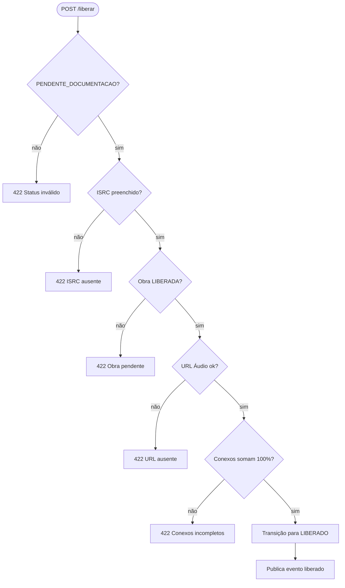
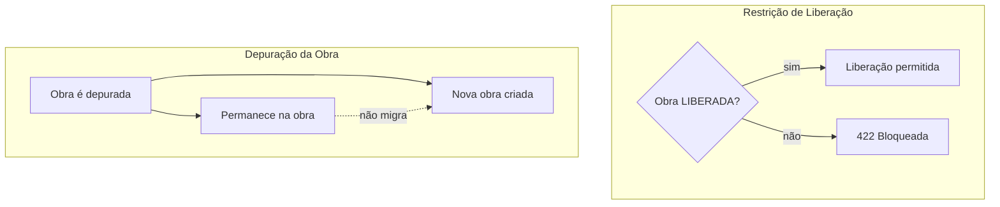
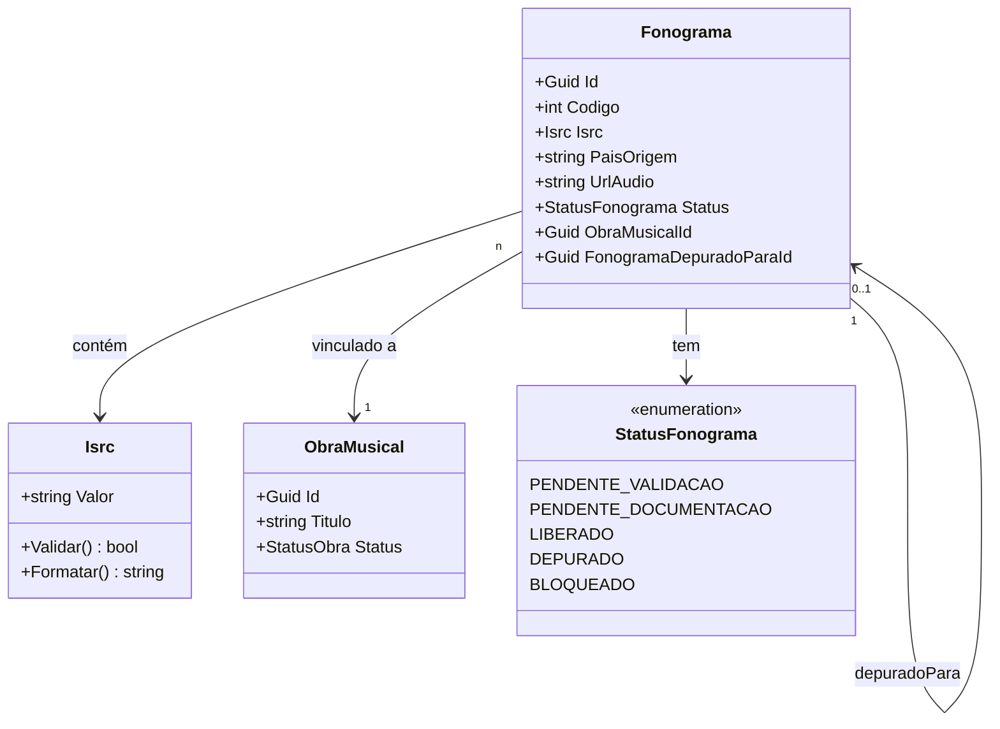
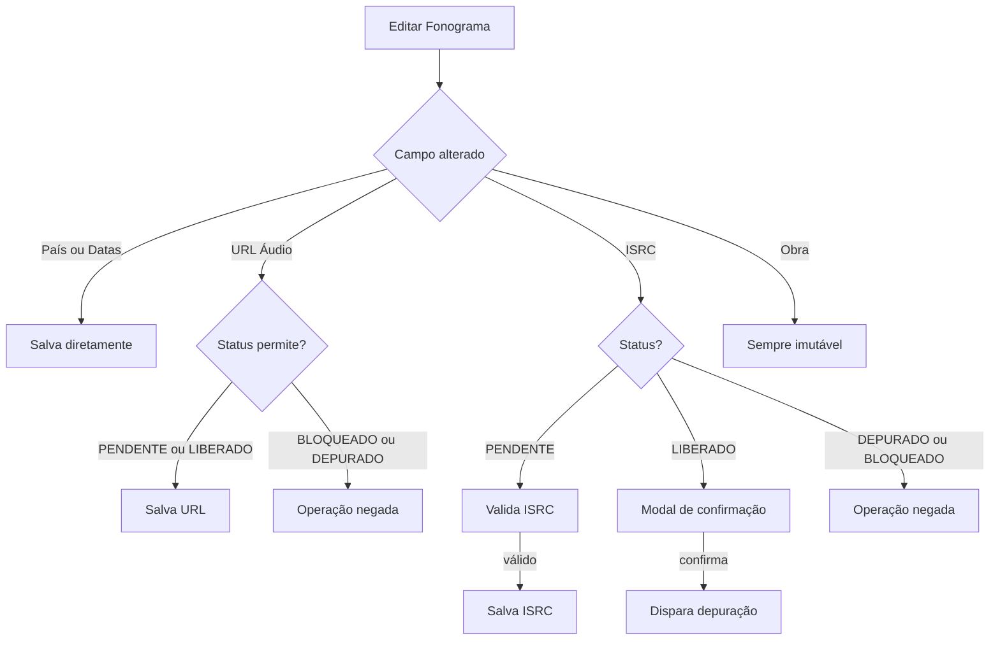

# Diagramas Mermaid — F05: Gestão de Fonogramas

## Visão Geral

A feature F05 implementa o CRUD de fonogramas no domínio Cadastro (D01). Fonogramas são gravações de obras musicais identificadas pelo código ISRC internacional, e são o elo entre a composição e o domínio de Identificação (D02). O sistema controla um ciclo de status com cinco estados (PENDENTE_VALIDACAO, PENDENTE_DOCUMENTACAO, LIBERADO, DEPURADO, BLOQUEADO) e aplica o mecanismo de depuração — preservação imutável do fonograma original — quando o ISRC de um fonograma liberado é alterado.

## Elementos Identificados

### Fluxos Externos

- Analista de Cadastro: cria, edita, depura, bloqueia e exclui fonogramas
- Consultor: acessa fonogramas em modo somente leitura
- D02 Identificação: consulta fonogramas por ISRC (exige status LIBERADO)
- F03 Obras: fornece a obra vinculada — FK obrigatória e imutável
- F06 Participações Conexas: gestão de conexos que influenciam a liberação
- F07 Controle de Status: gerencia transição PENDENTE_VALIDACAO para PENDENTE_DOCUMENTACAO

### Processos Internos

- Validação de ISRC: formato `CC-XXX-YY-NNNNN` e unicidade no sistema
- Criação com status inicial PENDENTE_VALIDACAO
- Depuração: fonograma original → DEPURADO (imutável), novo fonograma → PENDENTE_VALIDACAO
- Pré-requisitos de liberação: ISRC presente, obra LIBERADA, participações conexas = 100%, URL de áudio preenchida
- Publicação de eventos via Outbox: `cadastro.fonograma.liberado`, `cadastro.fonograma.depurado`, `cadastro.fonograma.bloqueado`

### Variações de Comportamento

- Edição de ISRC em PENDENTE: valida formato e unicidade, salva sem depuração
- Edição de ISRC em LIBERADO: exige confirmação e dispara depuração
- País e datas: editáveis livremente em PENDENTE e LIBERADO
- Obra vinculada: sempre imutável após criação
- DEPURADO e BLOQUEADO: bloqueiam edição de campos

### Contratos Públicos

- `POST /api/v1/fonogramas` — criação
- `GET /api/v1/fonogramas` — listagem com paginação e filtros
- `GET /api/v1/fonogramas/{id}` — consulta individual
- `PUT /api/v1/fonogramas/{id}` — edição
- `DELETE /api/v1/fonogramas/{id}` — exclusão
- `POST /api/v1/fonogramas/{id}/depurar` — depuração
- `POST /api/v1/fonogramas/{id}/liberar` — liberação
- `POST /api/v1/fonogramas/{id}/bloquear` — bloqueio
- `POST /api/v1/fonogramas/{id}/desbloquear` — desbloqueio
- `GET /api/v1/fonogramas/{id}/historico-bloqueios` — histórico de bloqueios

## Diagramas

### Ciclo de Status do Fonograma

Este diagrama de fluxo mostra a máquina de estados completa do fonograma, com os cinco estados possíveis e todas as transições entre eles. É fundamental para entender quais operações são permitidas em cada estado e quais caminhos levam à imutabilidade. Os estados terminais DEPURADO e as transições de exclusão delimitam o ciclo de vida do registro.

**Notas**:
- DEPURADO é estado terminal e imutável — não pode ser editado, bloqueado ou excluído
- BLOQUEADO pode ser excluído (além de PENDENTE_VALIDACAO e PENDENTE_DOCUMENTACAO)
- LIBERADO não pode ser excluído diretamente — exige depuração antes
- A transição PENDENTE_VALIDACAO → PENDENTE_DOCUMENTACAO é gerenciada pela feature F07

---

### Criação de Fonograma

Este diagrama de sequência descreve o fluxo principal de criação de um fonograma, desde o preenchimento do formulário pelo Analista até a persistência no banco de dados. Inclui as duas camadas de validação do ISRC — verificação de formato no frontend em tempo real e verificação de unicidade no backend. Este é o happy path que toda a operação subsequente pressupõe.

**Notas**:
- Validação de formato no frontend segue regex `CC-XXX-YY-NNNNN` (2 letras país, 3 chars registrante, 2 dígitos ano, 5 dígitos número)
- ISRC é armazenado sem hífens no banco e formatado para exibição
- Status inicial sempre é PENDENTE_VALIDACAO
- A obra vinculada é obrigatória — `obraId` deve referenciar obra existente

---

### Fluxo de Depuração por Alteração de ISRC

Este diagrama de sequência detalha o mecanismo de depuração disparado quando o Analista altera o ISRC de um fonograma no estado LIBERADO. A depuração é o único modo de preservar o histórico da gravação original — o fonograma original torna-se imutável e um novo é criado para continuar o ciclo de vida. Este fluxo é não óbvio porque dois registros coexistem após a operação.

**Notas**:
- O fonograma original mantém o ISRC antigo, suas participações conexas e torna-se imutável
- O novo fonograma herda a obra vinculada mas não herda as participações conexas (recadastradas em F06)
- `fonogramaDepuradoParaId` no original aponta para o ID do novo fonograma
- Alterações de país e datas em fonograma LIBERADO não disparam depuração

---

### Pré-requisitos de Liberação

Este fluxograma descreve a cadeia de validações executadas pelo endpoint `POST /liberar`, que transiciona o fonograma para LIBERADO. Cada pré-requisito deve ser satisfeito em sequência; qualquer falha retorna 422 com mensagem específica. A lógica é não óbvia porque envolve quatro condições heterogêneas — inclusive o estado de uma entidade externa (a obra vinculada).

**Notas**:
- O ponto de entrada é `PENDENTE_DOCUMENTACAO` — o status `PENDENTE_VALIDACAO` não pode ser liberado diretamente
- A soma de participações conexas deve ser exatamente `100.0000%` (precisão decimal de 4 casas)
- A verificação de obra LIBERADA implementa a interdependência de status descrita em RF-23
- Todas as validações são verificadas na camada de Application antes de qualquer transição

---

### Interdependência de Status com Obra

Este diagrama de fluxo ilustra as duas regras de negócio que acoplam o status do fonograma ao status da obra vinculada. A primeira impede a liberação quando a obra ainda está pendente; a segunda é contra-intuitiva — quando uma obra é depurada, os fonogramas vinculados não migram para a nova obra e permanecem na obra original (agora DEPURADA).

**Notas**:
- A restrição de liberação é verificada a cada chamada ao endpoint `POST /liberar`
- Quando F03 depura uma obra, o fonograma continua vinculado à obra original — agora com status DEPURADA
- A não-migração é intencional: preserva o vínculo histórico entre fonograma e obra original
- Um fonograma pode estar vinculado a uma obra DEPURADA indefinidamente

---

### Modelo de Dados

Este diagrama de classes apresenta a estrutura do agregado Fonograma, o Value Object ISRC com suas regras de validação e formatação, e as relações com ObraMusical e com o próprio fonograma depurado (auto-referência). O diagrama é útil para compreender as restrições de integridade referencial e a imutabilidade estrutural do campo obra.

**Notas**:
- `Isrc` é um Value Object com validação de formato `CC-XXX-YY-NNNNN` — mesmo padrão de CPF/CNPJ no projeto
- `Codigo` é identificador sequencial legível (além do UUID) retornado em listagens e respostas
- `ObraMusicalId` é FK imutável após criação — campo não pode ser alterado em nenhum estado
- `FonogramaDepuradoParaId` é FK auto-referente, nulo em fonogramas não depurados

---

### Regras de Edição por Campo e Status

Este fluxograma mostra a lógica de decisão aplicada a cada edição de campo, variando conforme o status atual do fonograma. É útil para entender quais operações exigem ação explícita do Analista (confirmação de modal) versus quais são transparentes, e onde a edição é simplesmente negada.

**Notas**:
- País e datas são os únicos campos editáveis livremente em todos os estados não bloqueados
- Editar ISRC em fonograma PENDENTE exige validação de formato e unicidade — sem depuração
- Editar ISRC em fonograma LIBERADO dispara o fluxo de depuração (ver diagrama anterior)
- BLOQUEADO bloqueia edição de todos os campos, incluindo URL de áudio
- A obra vinculada nunca pode ser alterada — trocar de obra requer exclusão e recriação do fonograma
